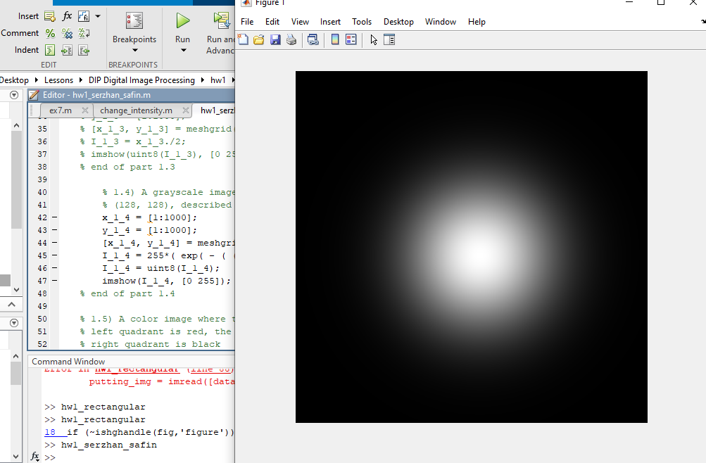
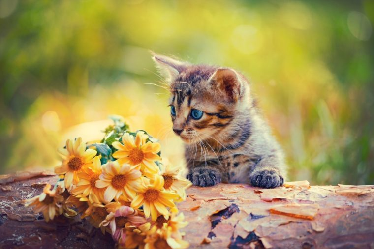
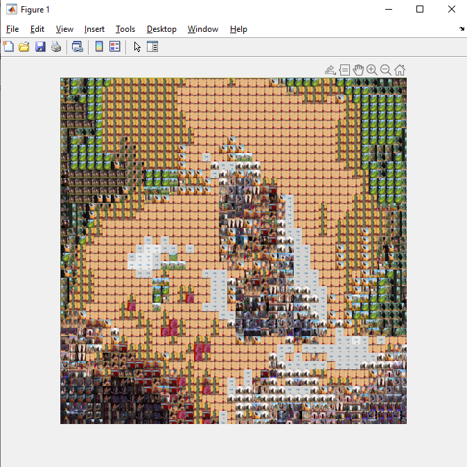
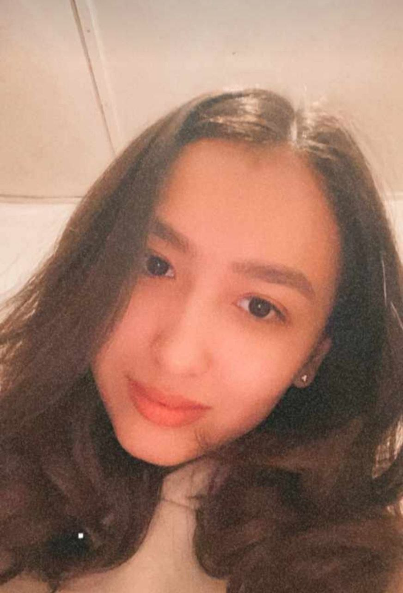
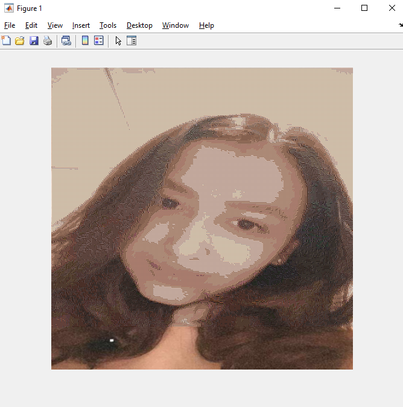

# image-mocaic-matlab
The target image is composed from the images dataset

# The warm-up part
A 1000x1000 8-bit image was created.
1.1) A grayscale image with constant intensity was created using matrices

.PNG)

1.2) A grayscale image with alternating black and white vertical stripes, each of which is 4 pixels wide
There I have implemented 2 variants of that
The first one grdually changes from black to white alternating the vertical stripes with width 4 pixels
 

.PNG)

The second variant includes immediate change of black and white only, i.e the vertical stripes (0 and 255)
They were alternating one by one, each having 4 pixels width

.PNG)

1.3) A grayscale image with a ramp intensity distribution, described by I(x, y) = x/2
The intensity was changed according the given function and matrix was formed with the help of meshgrid

.PNG)

1.4) A grayscale image with a Gaussian intensity distribution centered at (128, 128), described by the specific formula

1.5) A color image where the upper left quadrant is yellow, the lower left quadrant is red, the upper right
quadrant is green, and the lower right quadrant is black
So, all the half left was filled with R color
All the upper half was filled with R color
When green and red are mixed, yellow color is obtained
The part where black, rgb color is zero
.PNG)

# Main Part

The original (target) image was divided into partitions.
So that the average rgb values of partition of target image and the image located in the dataset would be compared.
The images in the dataset were created using the image_grab application.
The images were grabed from the cartoon "Ferdinand".
Here is the original image of the kitten:

Then the hight and width were chosen to be 18
The resultant image was like that:

Then, the height and width were chosen to be 12
The result was like this:

Much better now!
But it took more time to process

A lot of time was taken to produce a photo of one girl
The height and width were chosen to be 2
So for the benefit of quality, the price of time was taken :)
You can see the original photo of the girl:
{:height="700px" width="400px"}

And now it is processed, but not till the end, because my patience was over.
Here in the bottom you can see parts that were not done

